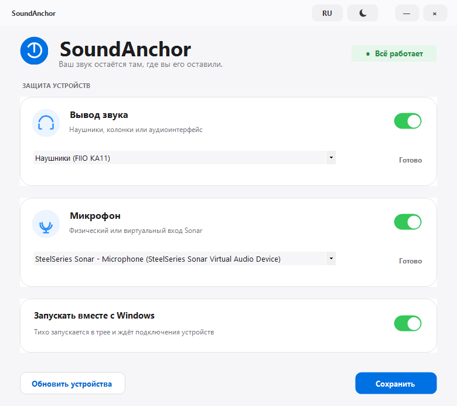

# SoundAnchor

SoundAnchor — компактное Windows-приложение, которое не позволяет SteelSeries GG / Sonar самовольно менять выбранные устройства звука.



## Возможности

- независимо закрепляет устройство вывода и микрофон;
- восстанавливает устройства для обычного звука, мультимедиа и связи;
- ждёт временно отключённые USB-устройства и автоматически применяет их после подключения;
- работает в области уведомлений и не показывает лишних сообщений;
- позволяет временно приостановить защиту через меню значка;
- переключается между русским и английским языком без перезапуска;
- поддерживает светлую и тёмную тему и запоминает выбор;
- использует собственную компактную верхнюю панель вместо стандартной рамки Windows;
- запускается вместе с Windows без прав администратора;
- устанавливается для текущего пользователя и появляется в списке установленных приложений;
- не меняет громкость, эквалайзер и настройки SteelSeries Sonar.

## Предварительная версия

Запустите `dist\SoundAnchor-preview.exe`. На первом экране можно установить приложение или выбрать портативный запуск. После установки выберите нужные устройства и нажмите «Сохранить».

Это версия `0.9.0-preview`, подготовленная для проверки перед первым публичным релизом.

## Сборка

Проект не использует внешние библиотеки. На Windows выполните:

```powershell
powershell.exe -NoProfile -ExecutionPolicy Bypass -File .\build.ps1
```

Для smoke-теста Core Audio и снимка интерфейса:

```powershell
powershell.exe -STA -NoProfile -ExecutionPolicy Bypass -File .\tests\SmokeTest.ps1
```

Настройки находятся в `HKCU\Software\SoundAnchor`. Автозапуск создаётся в пользовательском разделе `Run`, поэтому UAC и права администратора не требуются.

## Совместимость

- Windows 10 и Windows 11;
- физические USB/3.5 мм/Bluetooth-аудиоустройства;
- виртуальные устройства SteelSeries Sonar;
- системный .NET Framework, без отдельной установки runtime.

## Лицензия

MIT
